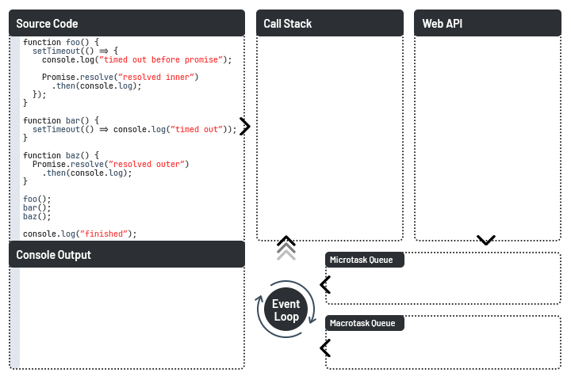

# JavaScript Cheatsheet

This guide contains brief overview of JavaScript's main concepts and known pitfalls.
It might be used as a reference for interview preparation.

## Table of Contents

* [1. Variables](#variables)
  * [1.1. `var` keyword](#var-keyword)
  * [1.2. `let` and `const` keywords](#let-and-const-keywords)
  * [1.3. Hoisting](#hoisting)
  * [1.4. Destructuring](#destructuring)
* [2. Data Types](#data-types)
  * [2.1. Number](#number)
  * [2.2. BigInt](#bigint)
  * [2.3. Boolean](#boolean)
  * [2.4. String](#string)
  * [2.5. `null`/`undefined`](#nullundefined)
  * [2.6. Symbol](#symbol)
  * [2.7. Object](#object)
  * [2.8. Type Conversion](#type-conversion)
    * [2.8.1. Conversion Rules](#conversion-rules)
    * [2.8.2. Explicit Conversion](#explicit-conversion)
    * [2.8.3. Implicit Conversion](#implicit-conversion)
* [3. Collections and Data Structures](#collections-and-data-structures)
  * [3.1. Arrays](#arrays)
    * [3.1.1. Array Creation](#array-creation)
    * [3.1.2. Array Elements Access](#array-elements-access)
    * [3.1.3. Array Frequently Used API](#array-frequently-used-api)
  * [3.2. Sets](#sets)
  * [3.3. Maps](#maps)
    * [3.3.1. WeakMap](#weakmap)
    * [3.3.2. Map API](#map-api)
* [4. Functions](#functions)
  * [4.1. Parameters and Arguments](#parameters-and-arguments)
    * [4.1.1. Arguments Pseudo-Array](#arguments-pseudo-array)
    * [4.1.2. Rest Parameters/Spread Arguments](#rest-parametersspread-arguments)
    * [4.1.3. Default Arguments](#default-arguments)
    * [4.1.4. Argument Destructuring](#argument-destructuring)
  * [4.2. Lexical Environment](#lexical-environment)
  * [4.3. Closure](#closure)
  * [4.4. Constructor call with `new`](#constructor-call-with-new)
  * [4.5. `this`](#this)
    * [4.5.1. Context Binding Functions](#context-binding-functions)
    * [4.5.2. Context Binding Rules](#context-binding-rules)
  * [4.6. Arrow Functions](#arrow-functions)
  * [4.7. Generators](#generators)
    * [4.7.1. Generator Declaration and Usage](#generator-declaration-and-usage)
    * [4.7.2. Iterators](#iterators)
    * [4.7.3. Generator Delegation](#generator-delegation)
    * [4.7.4. Generator API](#generator-api)
* [5. Classes and Objects](#classes-and-objects)
  * [5.1. Objects](#objects)
  * [5.2. Property Descriptors](#property-descriptors)
  * [5.3. Prototype Inheritance](#prototype-inheritance)
  * [5.4. Classes](#classes)
  * [5.5. Class Inheritance](#class-inheritance)
* [6. Asynchronous Programming](#asynchronous-programming)
  * [6.1. Callbacks](#callbacks)
  * [6.2. Timeouts and Intervals](#timeouts-and-intervals)
  * [6.3. Promises](#promises)
    * [6.3.1. States and Fates](#states-and-fates)
    * [6.3.2. Promise API](#promise-api)
  * [6.4. `async`/`await`](#asyncawait)
  * [6.5. Rendering](#rendering)
  * [6.6. Event Loop](#event-loop)
    * [6.6.1. Call Stack](#call-stack)
    * [6.6.2. Web API](#web-api)
    * [6.6.3. Callback Queue](#callback-queue)
    * [6.6.4. Event Loop Demo](#event-loop-demo)

<!---------------------- 
VARIABLES
----------------------->
## Variables

> **Variables** are references to memory blocks of certain size used to store data.
> When an undeclared variable is referenced an exception with message `foo is not defined` is thrown.

### `var` keyword

> The `var` keyword is used to declare **function scoped** variables in JavaScript.
> That is, a variable declared using `var` is **visible anywhere inside of the enclosing function's body**.

```JavaScript
function foo() {
    var a = 1;

    {
        // visible anywhere inside foo()
        var b = a + 2;
    }

    function bar() {
        // visible only inside bar()
        var b = a + 1;

        return b;
    }

    console.log(a + b);
}

foo(); // 4
```

Once a variable is declared using `var`, it can be accessed as a property of the `window` object.
**It also works vice versa.**

```JavaScript
var a = 1;
window.b = 2;

console.log(window.a); // 1
console.log(b) // 2
```

When a `var` variable is referenced **before** declararion its value is evaluated to `undefined`.

```JavaScript
console.log(a); // undefined
var a = 1;
```

### `let` and `const` keywords

Starting from **ECMAScript 2015** JavaScript allows variable declaration using `let` and `const` keywords.

> * Unlike variables declared with `var` the ones declared using `let` and `const` are **block scoped**, that is,
> they are **visible only inside of the enclosing block** or, when it comes to loops, **within a single iteration**.
> * `let` and `const` variables **cannot** be accessed via `window` and are **not accessible before declaration** statement.
> * Any attempts to **redeclare** variables using `let`/`const` keywords will result in `SyntaxError`.

The only difference between `let` and `const` is that **constants cannot be assigned new values** in the future.
However, `const` keyword **cannot guarantee** that the current value itself will not be modified - it protects only from reassignment and hence constants
must be initialized right in the declaration statement.

```JavaScript
let a = 1;

{
    console.log(b); // ReferenceError: b is not defined   
    let b = 2; // visible only inside this block
}

console.log(b); // ReferenceError: b is not defined

const arr = [];
console.log(arr); // []

arr = [1]; // TypeError: Assignment to constant variable

arr.push(1);
console.log(arr); // [1]

```

### Hoisting

> **Hoisting** is JavaScript behaviour of moving variable declarations to the top of the current scope during compilation.
> Note that **only declarations get hoisted**, while **initialization remains unaffected**.

Hoisting is the reason why `var` variables' values can be accessed before actual declaration statements. It also explains why
those values are evaluated to `undefined` (because initialization is unaffected by hoisting).

However, values of `let` and `const` variables **cannot be used before declaration statements** as these variables **do not get initialized until the declaration**.

### Destructuring

> **Destructuring** is the feature that has come to JavaScript with **ECMAScript 2015**
> It allows for mapping values of arrays and object fields to new variables.

```JavaScript
var { a } = { a: 42 }; // value of 'a' field is assigned to a new variable 'a'
let [b] = [1, 2]; // first value is assigned to 'b'
const { c: foo } = { a: 10, b: 20, c: 30 }; // value of 'c' field is assigned to a new constant 'foo' 

console.log(a); // 42
console.log(b); // 1
console.log(foo); // 30

```

<!---------------------- 
DATA TYPES
----------------------->
## Data Types

> **JavaScript** has **8 built-in data types**. Those are: `number`, `bigint`, `boolean`, `string`, `null`, `undefined`, `symbol` and `object`.

### Number

> The `Number` type is a **double-precision 64-bit binary format IEEE 754 value**. It is capable of storing positive floating-point numbers between `Number.MIN_VALUE` and `Number.MAX_VALUE` as well as > negative floating-point numbers between `-Number.MIN_VALUE` and `-Number.MAX_VALUE`, but **it can only safely store integers in the range `Number.MIN_SAFE_INTEGER` to `Number.MAX_SAFE_INTEGER`**.

Besides, `number` type contains some special values:

* `Infinity` - Positive Infinity, can also be referenced by `Number.POSITIVE_INFINITY`. Used to refer to numbers greater than `Number.MAX_VALUE`.
* `-Infinity` - Negative Infinity, can also be referenced by `Number.NEGATIVE_INFINITY`. Used to refer to numbers lower than `Number.MIN_VALUE`.
* `+0` / `-0` - Positive/Negative zeroes, equivalent to unsigned zero `0`.
* `NaN` - Refers to values that cannot be represented as valid numbers. Can also be referenced by `Number.NaN`. It's unsafe to use equality operations to determine whether or not a value is `NaN` -
`isNaN()` and `Number.isNaN()` functions must be used for this purpose. `isNaN()` returns `true` in case an argument is `NaN` **after performing implicit conversion to number** whereas `Number.isNaN()` does not perform any implicit conversions and returns `true` **only if an argument is `NaN`**.

### BigInt

> Introduced in **ECMAScript 2020**, `BigInt` is a primitive type that represents an integer value of arbitrary size. It is not limited to a particular bit-width.
> To represent `bigInt` values `n` is appended to a numeric literal e.g. `1n`.

`BigInt` and `Number` values are not interchangable: `bigInt`s cannot be used to represent floating-point numbers whereas `number` **cannot** be used to represent numeric values of *any* size. Hence, a type conversion must be performed before any operations between values of these types.

### Boolean

> The `Boolean` type represents a logical entity having two values - `true` and `false`.

### String

> The `String` type represents textual data and is encoded as a **sequence of 16-bit unsigned integer values** representing UTF-16 code units. Each element in the string occupies a position in the string which corresponds to a non-negative integer index.

Strings can be defined either **by using quotes** (`'` and `"` - there is **no difference** between single and double quotes) or **by using template string literals** (or backticks `` ` ``).

**String templates** were introduced in ECMAScript 2015 and **allow value interpolation**:

```JavaScript
console.log(`2 + 2 = ${2 + 2}`); // 2 + 2 = 4
```

JavaScript strings are **immutable**. This means that once a string is created, it is not possible to modify it. **String methods create new strings** based on the content of the current string.

### `null`/`undefined`

> The Null type has **exactly one value**, called `null`. Note that `typeof null` will return `'object'` - that's a known bug that remains solely for backward compatibility reasons. \
\
> The Undefined type has **exactly one value**, called `undefined`. Any variable that has not been assigned a value has the value `undefined`.

### Symbol

> `Symbol` is a built-in object whose constructor returns a symbol primitive — a Symbol value or just a Symbol — that's **guaranteed to be unique**.

Symbols are often used to add unique property keys to an object that won't collide with keys any other code might add to the object, and which are hidden from any mechanisms other code will typically use to access the object.

Every `Symbol()` call is guaranteed to return a unique Symbol. Every `Symbol.for("key")` call will always return the same Symbol for a given value of "key". When `Symbol.for("key")` is called, if a Symbol with the given key can be found in the global Symbol registry, that Symbol is returned. Otherwise, a new Symbol is created, added to the global Symbol registry under the given key, and returned.

### Object

> `Object` is a collection of key-value pairs also called properties. Property keys can be values of either `String` or `Symbol` types - **keys of any other type will be converted to strings** according to these types' `toString()` method implementation. \
\
> Despite the fact that `typeof (function(){})` returns `'function'` - **functions are actually objects** but with the additional capability of being **callable**. `Arrays` are **also objects**.

*Read more about objects:* [5.1. Objects](#objects)

### Type Conversion

#### Conversion Rules

**`Number` conversion rules:**

* `undefined` gets converted to `NaN`.
* `null` gets converted to `0`.
* `true` gets converted to `1`, `false` gets converted to `0`.
* `String` is parsed **as if it contained a valid numeric literal**. Parsing failure results in `NaN`. String is considered **valid if**:
  * It **only has** a valid binary, octal, decimal or hexadecimal numeric literal. (**no** numeric separators `_` allowed)
  * It **might have** trailing or/and leading whitespace characters (any non-numeric characters in the middle are disallowed)
  * It `Infinity` literal. Both `-Infinity` and `+Infinity` are supported.
  * It is **empty or contains only whitespace**. The conversion results in `0` in these cases.
* `BigInt` throws `TypeError` to avoid possible loss.
* `Symbol` throws `TypeError`.
* `Object` calls its conversion methods `[Symbol.toPrimitive]()`, `valueOf()` and `toString()` in that exact order until it gets a valid primitive which is then gets converted to `Number`. If none of the methods return a valid number `TypeError` gets thrown.

**`String` conversion rules:**

* `undefined` gets converted to `'undefined'`, `null` gets converted to `'null'`.
* `true` gets converted to `'true'` and `false` gets converted to `'false'`.
* `Number` gets converted to its corresponding **base-10** numeric literal string. Same as `toString(10)` call.
* `BigInt` gets converted to its corresponding **base-10** `bigInt` literal string. Same as `toString(10)` call.
* `Symbol` gets converted to `'Symbol(key)'` string where `key` is a string used to reference target `Symbol`.
* `Object` calls its conversion methods `[Symbol.toPrimitive]()`, `toString()` and `valueOf()` in that exact order until it gets a valid primitive which is then gets converted to `String`. If none of the methods return a valid string `TypeError` gets thrown.

**`Boolean` conversion rules:**

Everything except for the following gets converted to `true`:

* `undefined`
* `null`
* `NaN`
* `0`, `-0`, `+0`
* `0n`
* Empty strings (strings with whitespace get converted to `true`)

**`Object` conversion rules:**

* `undefined` and `null` throw `TypeError`.
* `Number`, `String`, `Boolean`, `Symbol` and `BigInt` get wrapped to their corresponding object wrappers.

**`Symbol` conversion rules:**

Everything is converted to `Symbol(key)` where the `key` is a target value converted to `String`.

#### Explicit Conversion

> Explicit type conversion is performed calling the respected types' constructor functions with value in question as an argument.

Available type constructors are:

* `Number()`
* `BigInt()`
* `Boolean()`
* `String()`
* `Symbol()`
* `Object()`

*Apart from constructor calls*, one can convert values to `Number` using `parseInt()`/`parseFloat()` functions and conversion to `String` can also be performed with `toString()` method.

#### Implicit Conversion

> Implicit conversion takes place when a different type is expected in the operation that is performed to a value.

* Conversion to `number` **occurs mostly in mathematical operations** where an operand is expected to be `number`. **The only exception is binary addition `+`** operation which is overloaded for string concatenation - in case of binary addition between `number` and `string`, a numeric operand gets converted to `string`.
* Conversion to `string` occurs when:
  * A value is passed to **template string literal**.
  * A value is passed to `Symbol` constructor.
  * A value is used in **binary addition** operation `+` where **at least one** of the operands is `string`.
  * A value is used as an **object property key** or as an **array index**.
* Conversion to `boolean` occurs in statements and operations **that expect a `boolean`**:
  * `if ()`
  * `while ()`
  * `for ()`
  * `!`

<!---------------------- 
COLLECTIONS AND DATA STRUCTURES
----------------------->
## Collections and Data Structures

### Arrays

> Unlike raw arrays, **arrays in JavaScript are objects** where **each index is just a numeric property key**. Although it is not recommended, one can define any regular property in an array. However, the only array property that is considered valid is `length`. Despite it can be overridden, one should avoid modifying array's `length` directly as it is considered a bad practice.

#### Array Creation

> Arrays can be defined either using `[]` syntax or by calling `Array()` constructor. **Passing a single argument** will define array's `length` whereas if **more than one argument is passed** to the constructor they will define **array's contents**.

If `length` is either defined by calling `new Array(n)` or altered directly, in other words, if the value of `length` property is greater than the actual number of elements in the array, all of the indexes that were not assigned a value are **not initialized** and values at these positions are marked as *empty slots*.

```JavaScript
const arr1 = [];
const arr2 = [1, 2, 3];
const arr3 = new Array(1); // [1 x Empty]
const arr4 = new Array(1, 2, 3); // [1, 2, 3]
```

> Arrays can also be created out of existing *array-like* structures (e.g. pseudo-arrays, strings) using static method `Array.from()`. **Any invalid value** is converted to an empty array.

```JavaScript
Array.from("abc"); // ['a', 'b', 'c']
Array.from([1, 2, 3]); // [1, 2, 3]
Array.from(0) // []
Array.from({}) // []
Array.from(true) // []
```

#### Array Elements Access

> Array elements are accessed using square brackets `[]` with an index of the desired element passed in.
In case of an *out of bounds* access `undefined` is returned.

```JavaScript
const arr = [1, 2, 3];

console.log(arr[0]); // 1
console.log(arr[3]); // undefined
```

> To check if an element is present in an array one can use `indexOf()` or, since ECMAScript 2016, `includes()`.

```JavaScript
const arr = [1, 2, 3];

arr.indexOf(1); // 0
arr.indexOf(4); // -1

arr.includes(1); // true
arr.includes(4); // false

```

> Sub-arrays aka *slices* can be retrieved via `slice(from, to)` method.

```JavaScript
const arr = [1, 2, 3];

arr.slice(1); // [2, 3]
arr.slice(0, 2); // [1]
```

#### Array Frequently Used API

```JavaScript
const arr = [];

/** Deque API */

// add elements to the end, return new length
arr.push(1); // 1
arr.push(2, 3); // 3
console.log(arr) // [1, 2, 3]

// pop element from the end, return popped element
arr.pop(); // 3
arr.pop(); // 2
console.log(arr) // [1]

// add element to the beginning, return new length
arr.unshift(2);
console.log(arr); // [2, 1]

// remove element from the beginning, return removed element
arr.shift();
console.log(arr); // [1]

// splice(index, removeCount, ...newElements): add/remove/replace elements in array
// returns an array of removed elements
arr.splice(1, 0, 2, 3); // []
console.log(arr); // [1, 2, 3]

arr.splice(2, 1); // [3]
console.log(arr); // [1, 2]

arr.splice(1, 1, 3, 4); // [2]
console.log(arr); // [1, 3, 4]

/** ES5 functional API */

// find the first element for which the argument function returns true
// return undefined if not found
arr.find(element => true); // 1

// check if function is true at least for one element
arr.some(element => true); // true

// check if function is true for all elements
arr.every(element => true); // true

// return new array with only elements for which function returns true
arr.filter(element => true); // [1, 2, 3]

// do action for each element in the array
arr.forEach(element => console.log(element));

// apply operations to each element in the array 
// passing the result of previous operations to the next call
arr.reduce((sum, element) => sum + element, 0); // 6 

```

### Sets

> The `Set` object allows for storage of **unique values of any type**, whether primitive values or object references. `WeakSet` works in the same manner except for that it **accepts only values** of type `Object`.

```JavaScript
const set = new Set();

set.add(1); // Set(1)
set.has(1); // true

set.size; // 1
set.delete(1); // true
set.clear();

```

### Maps

> The `Map` object holds key-value pairs and **remembers the original insertion order** of the keys. **Any value (including objects)** might be used as either a key or a value.

`Object` is similar to Map - both allow for setting keys to values, retrieve those values, delete keys, and detect whether something is stored at a key. For this reason (and because there were no built-in alternatives), `Object` has been used as Map historically.

Differences between `Object` and `Map` are following:

* `Map` contains no *inherited* keys whereas `Object` may contain references to some external properties defined in prototypes.
* `Map` **accepts any type of values as keys** whereas `Object` accepts only `Symbols` and `Strings`.
* `Map` **has reliable key ordering** determined by insertion order. Ordering of keys in `Object` is not guaranteed.
* `Map` **has** `size` property. Size of `Object` can be determined using `Object.keys().length`.
* `Map` **has built-in** iterator. `Object` values can be iterated over via `Object.entries()`/`Object.values()`/`Object.keys()`.
* `Map` is claimed to have **better performance for additions/deletions**.
* `Map` **has no built-in support** for serialization. `Object` natively supports serialization.

#### WeakMap

> `WeakMap` is different from `Map` in that it accepts **only objects** as keys. In addition, it **does not allow** observing the state of its keys.

`WeakMap` allows associating data to objects in a way that doesn't prevent the key objects from being collected, even if the values reference the keys. However, a `WeakMap` **doesn't allow observing the liveness of its keys**, which is why it doesn't allow enumeration. If a `WeakMap` exposed any method to obtain a list of its keys, the list would depend on the state of garbage collection, introducing non-determinism.

#### Map API

```JavaScript
const map = new Map();

map.set("a", 1); // Map("a" => 1)
map.has("a"); // true
map.get("a"); // 1

map.size; // 1
map.delete("a"); // true
map.clear();

```

<!---------------------- 
FUNCTIONS
----------------------->
## Functions

> Functions define **reusable blocks of code that can be executed multiple times** from any place in code where the function definition is available.
Function declaration consist of a name, a set of parameters - which together form **a function signature**, and a set of statements inside of a separate block of code - **function body**.

There are several ways to declare a function:

* ***Function Declaration***: Using a `function` keyword followed by a function signature (name + parameters) and a function body enclosed in curly braces `{ ... }`.
* ***Function Expression***: Nameless (anonymous) function declaration but **used as value in an expression** (e.g. assignment to a variable or constant).
* ***Named Function Expression (NME)***: Same as **regular function declaration** but **used as value in an expression** (e.g. assignment to a variable or constant).
* ***Immediately Invoked Function Expression (IIFE)***: a function declaration **followed by a set of parentheses** indicating instant function call.
* ***Arrow Function***: Introduced in ECMAScript 2015, an arrow function (lambda expression or just lambda) provides more concise way of function declaration.
* ***Function Instantiation***: Function creation via `new Function(body)` call.

Each function declaration approach has its features to take into account.

```JavaScript
/**
 * Functions created using Function Declaration are accessible anywhere in the code
 * regardless of whether they are called before of after actual definition statement.
 */

declare(); // can be called before declaration statement
function declare() {/* ... */}

/**
 * Function Expressions are not accessible before the declaration as they get assigned to variables
 * which get initialized only when the execution reaches variable declaration statement.
 */

expression(); // throws TypeError as foo is undefined before declaration
var expression = function() {/* ... */};

/**
 * Named Function Expressions behave in the same manner as Function Expressions do
 * except for that they have a name which is visible only in this function's scope and can be used to reference
 * this function when a recursive call is needed. 
 * (This might be useful when such function expression definitions get passed as arguments to other functions immediately)
 */

// This will output 3 in the console three times
[1, 2, 3].forEach(function add(item) {
  if (item < 3) {
    add(item + 1);
  }
  else {
    console.log(item);
  }
});

/**
 * Immediately Invoked Function Expressions are used to isolate the execution
 * of inner code from the global scope, thus hiding unnecessary implementation details.
 */

// Any attempt to access any of the constants out of the function code will fail
// Usually IIFEs are used to encapsulate more complex behaviour.
(function() {
  const a = 1, b = 2, c = 3, d = 4, e = 5, f = 6;

  console.log(a, b, c, d, e, f);
})();

/**
 * Arrow Functions is generally a more concise and convenient way to declare a function
 * However they also have some quirks that are important to be aware of. 
 * See 'Arrow Functions' section for more information.
 */

const arrow = () => console.log("Hello there!");
arrow(); // 'Hello there'

/**
 * new Function(bodyString) is pretty unconventional way of declaring a function and most of the times it must be avoided
 * as it is changes the source code dynamically, preventing compilers from doing performance optimization
 * let alone declaration of a function with runtime body resolution might itself be dangerous.
 */

const dynamic = new Function("console.log('Hello there');");
dynamic(); // 'Hello there'

```

### Parameters and Arguments

> Functions in JavaScript **accept any number of arguments regardless of what is defined in parameters list** of a function declaration.
Thus, omitted arguments evaluate to `undefined` while any extra arguments are just ignored (though their values can be accessed).
For that reason **there is no such thing as function overloading** in JavaScript. Moreover, functions in JavaScript are *first-class objects* so that **they can be used as values or passed as other functions' arguments**.

#### Arguments Pseudo-Array

> Historically, JavaScript functions have had a way of accessing arguments that were passed to them - `arguments` *pseudo-array*.
It must be emphasized that `arguments` **is not an actual array** but an array-like list of values passed to functions as arguments.

As of now, `arguments` **must be avoided** as there are better alternatives. Besides:

* `arguments` is not an actual array, so one cannot directly access any of the array methods to manipulate the values inside.
* `arguments` is not accessible from arrow functions.
* In older ECMAScript versions `arguments` values referenced the same memory space as actual argument variables, so altering this pseudo-array could result in changing the arguments.

```JavaScript
function foo(a, b, c) {
  console.log(arguments);
}

foo(1, 2, 3, 4, 5); // Arguments(5) [1, 2, 3, 4, 5]
```

#### Rest Parameters/Spread Arguments

> With introduction of ECMAScript 2015 it has become **possible to assemble an actual array from function arguments**.
This can be achieved by using **Rest/Spread** operator `...` in function declaration or function call.

```JavaScript
// Using rest operator to create an array from arguments
function foo(...rest) {
  console.log(rest);
}

foo(1, 2, 3, 4, 5); // [1, 2, 3, 4, 5]

// The same using spread operator to pass values from an array
const args = [1, 2, 3, 4, 5];
foo(...args); // [1, 2, 3, 4, 5]
```

#### Default Arguments

> Since ECMAScript 2015, JavaScript provides a way to define default values for arguments when those are omitted.

```JavaScript
// Before ECMAScript 2015
function foo(a) {
  a = a || 0; // or a === undefined ? 0 : a;

  console.log(a);
}

foo(); // 0

// After ECMAScript 2015
function bar(a = 0) {
  console.log(a);
}

bar(); // 0
```

#### Argument Destructuring

> Just like in variable declaration statements, **destructuring can also be used in function parameters declaration**.

```JavaScript
// Array destructuring
function foo([a, b, c]) {
  console.log(a, b, c);
}

// Object destructuring
function bar({ a, b: { c }}) {
  console.log(a, c);
}

foo([10, 20, 30]); // 10 20 30
bar({ a: 10, b: { c: 30 }}); // 10 30
```

### Lexical Environment

> Lexical Environment is a common name for an **object which keeps references of all local variables** declared in a certain scope.
Apart from global scope with its global lexical environment, **each function has its own scope and lexical environment**.
Inner lexical environments have **a hidden `[[Environment]]` property which is a reference to outer or parent lexical environment** where variables are looked for if not found in the current scope.

### Closure

> Ability of functions to access enclosing (outer) lexical environments is oftentimes referred to as *Closure*.

Technically, Closure is understood as either:

> * **A record** storing a first-class function with reference to an outer lexical environment.
> * **A binding** between a first-class function and its outer lexical environment.
> * **A first-class function itself** which can access the contents of its enclosing lexical environment.

Considering what was said earlier about [Lexical Environment](#lexical-environment), it becomes natural that every JavaScript function has access to its enclosing lexical environment and thus - a closure. **A closure is created for each function at function creation time**.

```JavaScript
function outer() {
  let count = 0;

  /**
   * With own lexical environment where 'inner' function's variables are defined
   * 'inner' has access to variables defined in an outer scope via [[Environment]] property.
   * When 'count' is not found in the current function's scope it is looked for in enclosing lexical environments.
   * As long as 'outer' function's scope is referenced by 'inner's [[Environment]] it's not getting garbage collected until 'inner' is accessible.
   */
  return function inner() {
    return ++count;
  }
}

const inner = outer();

inner(); // 1
inner(); // 2
inner(); // 3
```

### Constructor call with `new`

> Before introduction of classes in ECMAScript 2015 functions were used for objects instantiation.
This behaviour is reached by using `new` keyword next to the function call. **Constructor calls will always return an object**: if an object is specified explicitly in `return` statement - it will be returned, otherwise - constructor call will result in a new object instance.

*Note: Not all functions can be called with `new` - **using object methods or arrow functions as constructors will throw an error***

### `this`

> *Function execution context* is an object which is bound to a function during its execution. `this` is a keyword that serves as **a reference to current function execution context**. Unlike many other languages where methods are tightly bound to the objects where they are defined, in JavaScript even methods are just plain functions assigned to object properties. As a result, in most cases `this` has dynamic binding and **its value is determined during function call**.

#### Context Binding Functions

> Soft Binding - Binding a function to a specified execution context during a single function call.
> Hard Binding - Binding a function to a specified execution context for a period of function's lifetime.

There are 3 function methods that allow explicit execution context binding:

> * `.call(context[, arg1, arg2, ...])` - Soft Binding. Allows **immediate function call** with the specified `context` and arguments list.
> * `.apply(context[, ...args])` - Soft Binding. Allows **immediate function call** with specified `context` and arguments **array**.
> * `.bind(context[, arg1, arg2, ...])` - Hard Binding. **Returns a function wrapper** that is bound to `context` and can be called later. Supports currying.

#### Context Binding Rules

Following are the rules of `this` binding (from low to high priority):

1. By default **every function is bound to global object** (`undefined` in strict mode).
2. Object **methods are bound to objects they are called with**. If an object method is returned from expression - an object binding is lost and default case is applied.
3. Functions called with `.call(context)` or `.apply(context)` **are bound to objects passed as `context` argument**.
4. Functions explicitly bound to an object via `.bind(context)` **have constant binding to `context` object**.
5. Functions called with `new` **are bound to newly created object instance**.
6. Arrow functions **are statically bound to the execution context of the parent lexical environment**.

```JavaScript
const obj = {
  foo: function() {
    console.log(this);
  },

  bar: () => console.log(this),

  baz() {
    return () => console.log(this);
  }
};

// method call, context: obj {}
obj.foo();

// expression result call, context: default - global {}
(f = obj.foo)();
(obj.foo || null)();

// call/apply, context: { a: 10 }
obj.foo.call({ a: 10 });
obj.foo.apply({ a: 10 });

// bind, context: { b: 20 }
obj.foo.bind({ b: 20 })();
obj.foo.bind({ b: 20 }).call({ a: 10 });

// constructor call, context: new object foo {}
new obj.foo();

// constructor over bound function, error
new obj.foo.bind({ b: 20 });

/** Arrow functions **/

// method call, context: default - global {}
obj.bar();

// context taken from baz(): obj {}
obj.baz()();
obj.baz().call({ a: 10 });
obj.baz().bind({ b: 20 })();
```

### Arrow Functions

> Starting with ECMAScript 2015, JavaScript functions can be defined using arrow notation. Functions defined like this are called **arrow functions** or **lambdas**.

```JavaScript
// Empty function
const fn1 = () => {};

// Function which returns its argument
const fn2 = x => x;

// Function which takes more than one argument and contains more than one statement
const fn3 = (x, y, z) => {
  console.log(x, y, z);

  return x + y + z;
};
```

Arrow functions are **different** from regular functions in the following:

* Arrow functions cannot access `arguments` pseudo-array.
* Arrow functions are statically bound to execution context of outer lexical environment.
* Arrow functions cannot be used in a constructor call.

### Generators

> Introduced in ECMAScript 2015, generators are functions whose execution **can be paused yielding intermediary value and then continued until the final value is returned**.

#### Generator Declaration and Usage

> Generators are declared just like regular functions but **with an asterisk `*` appended to `function` keyword**. A key difference between regular functions and generators is a **`yield` operator which is used to suspend execution and yield a value or expression result** passed as an operand. In addition, **generator call does not start function body execution** - instead, it initializes the *generator object* which exposes the **`.next(value)` method that can be called to execute the next chunk of generator's statements** until `yield` or `return` operator is found.

```JavaScript
function* generator() {
  yield 1;

  const x = yield 2;

  return x;
}

// generator initialization
const gen = generator();

/**
 * .next(value) method optionally takes value parameter that can be used in a generator's body as the result of a `yield` operation.
 * .next(value) call returns on object with the current state of the generator { value: any, done: boolean } 
 * where value equals to what has been passed to yield statement and done is a flag that tells whether or not function finished execution (returned) 
 */
gen.next() // { value: 1, done: false }
gen.next() // { value: 2, done: false }
gen.next(3) // { value: 3, done: true }
```

#### Iterators

> Generators implement iterators functionality and thus can be used with spread `...` operator and inside of `for of` loops.

```JavaScript
function* sequence(n) {
    for (let i = 0; i < n; i++) {
        yield i;
    }
    return;
}

[...sequence(5)]; // [0, 1, 2, 3, 4]

// 0 1 2 3 4
for (let value of sequence(5)) {
  console.log(value);
}
```

#### Generator Delegation

> Generator's `.next()` call can be delegated to other generators by passing those generators to `yield` operator immediately followed by an asterisk `*`.

```JavaScript
// Ascending sequence
function* asc(n) {
    for (let i = 0; i < n; i++) {
        yield i;
    }
    return;
}

// Descending sequence
function* desc(n) {
    for (let i = n; i > 0; i--) {
        yield i;
    }
    return;
}

// Two-way sequence
function* seq(n) {
    yield* asc(n);
    yield* desc(n);
    
    return;
}

[...seq(3)]; // [0, 1, 2, 3, 2, 1]
```

#### Generator API

Apart from generators' `.next()` method, there are several other methods to work with generators:

* `.throw(error)` - allows terminating generator's execution by throwing an error.
* `.return(value)` - allows terminating generator's execution by early return.

<!---------------------- 
CLASSES & OBJECTS
----------------------->
## Classes and Objects

### Objects

> `Object` is a collection of key-value pairs also called properties. Property keys can be values of either `String` or `Symbol` types - **keys of any other type will be converted to strings** according to these types' `toString()` method implementation.

Objects can be created using the following approaches:

* By using object literal `{}`
* By calling constructor functions
* By calling constructor of a class
* By calling `Object.create(prototype)`
* By calling `Object.assign(target[, source1, source2, ...])`
* By calling `Object.fromEntries(keyValueList)`

Object properties can be accessed using the following approaches:

* By using dot operator `.` (`obj.prop`)
* By using square brackets `[]` with key passed as `String` or `Symbol`

### Property Descriptors

> Object properties can be of 2 types: *data properties* and *accessor properties*. **Data properties expose values** whereas **accessor properties are represented by accessor functions `get` and `set`** which handle retrieval and mutation of data from any other data property which is supposed to be private or inaccessible directly. A property can **either** be a data property or accessor property - there is no way to combine types.

```JavaScript
const obj = {
  // data property
  dataProp: 1,

  // accessor property
  _accessorProp: 2,

  get accessorProp() {
    return this._accessorProp;
  },

  set accessorProp(value) {
    this._accessorProp = value % 2 ? value : value + 1;
  },
};

console.log(obj.dataProp); // 1
console.log(obj.dataProp = 2); // 2

console.log(obj.accessorProp); // 2
console.log(obj.accessorProp = 3); // 4 
```

> In JavaScript each property can be configured using configuration objects called **property descriptors**. This can be achieved by using `Object.defineProperty(targetObj, propKey, descriptorObj)` or `Object.defineProperties(targetObj, descriptorsObj)`. A property descriptor can be retrieved with `Object.getOwnPropertyDescriptor(targetObj, propKey)` or `Object.getOwnPropertyDescriptor(targetObj)`.

Property descriptors contain the following properties:

* `value` - value for **data properties only**.
* `get` and `set` - accessor functions for **accessor properties only**.
* `enumerable` - if a property can be seen in iterations/enumerations.
* `writable` - if a **data property** can be reassigned.
* `configurable` - if a property descriptor can be configured.

```JavaScript
const obj = {};

/**
 * Despite that all flags are true by default for newly defined properties
 * They must be explicitly set in the descriptor. 
 * Otherwise unset flags will be considered undefined and thus - false.
 */
Object.defineProperty(obj, 'foo', {
  value: 1,
  writable: true,
  enumerable: true,
  configurable: true, 
});

Object.defineProperties(obj, {
  "bar": {
    value: 2,
    writable: true,
    enumerable: true,
    configurable: true,
  },

  "baz": {
    get: () => 3,
    set: value => {},
    enumerable: true,
    configurable: true, 
  }
});
```

There are a few methods of `Object` that allow to prevent different property mutations:

* `Object.preventExtensions(targetObj)` - **prevents new properties from being added** to object and **object's prototype from being re-assigned**.
* `Object.seal(targetObj)` - effects of `.preventExtensions()` + **prevents existing properties from being deleted or configured** (`configurable: false`).
* `Object.freeze(targetObj)` - effects of `.preventExtensions()` and `.seal()` + **prevents existing properties' values from being changed** (`writable: false`).

### Prototype Inheritance

Natively, JavaScript allows creation of anonymous objects, that are, objects that do not need a class to be constructed from. However, even anonymous objects are able to extend other object's behaviour which is accomplished via such concepts as **prototypes**, **prototype chain** and **prototype inheritance**.

> * **Prototype is basically any object** which serves as *base* for other objects.
> * Prototype chain is a **chain of objects each of which references its predecessor as prototype**.
> * Prototype inheritance, generally, is a type of inheritance which is based on object instances rather than classes - it can be implemented by **either copying of all existing base object's properties** into a *child* object with its own properties **or** by **storing a reference to the base object** and using it to access properties that are not defined for *child*. **JavaScript uses the latter approach** (also called **delegation**) storing a prototype reference inside of hidden property `[[Prototype]]`.

By default all newly created objects, which are not derived from a function or a class, have reference to `Object.prototype` as it is the *root* object that stores essential properties for objects. Objects can also be created with another prototype reference by calling `Object.create(prototypeObj[, descriptorsObj])`.

Object's prototype can be retrieved by `Object.getPrototypeOf(targetObj)` and set using `Object.setPrototypeOf(targetObj, prototypeObj)`. If an object was created using a constructor (either function or class `Foo`), its prototype can also be **read** via `Foo.prototype`. Another way of accessing an object's prototype is `__proto__` which is **not recommended**.

```JavaScript
function Foo() {}

const foo = new Foo();
const bar = Object.create(Object.prototype);
const baz = {};

// Objects bar and baz reference the same prototype - the root
console.log(
  Object.getPrototypeOf(bar) === Object.getPrototypeOf(baz) && Object.getPrototypeOf(bar) == Object.prototype,
); // true

// But foo has a different prototype - Foo.prototype"
console.log(
  Object.getPrototypeOf(foo) === Object.prototype,
  Object.getPrototypeOf(foo) === Foo.prototype,
); // false true

// Foo.prototype has reference to Object.prototype
console.log(Object.getPrototypeOf(Foo.prototype) === Object.prototype); // true

// foo is now prototype for bar
// so that bar will reference foo if a certain accessed property is not defined in bar 
Object.setPrototypeOf(bar, foo);

// bar is prototype for baz
Object.setPrototypeOf(baz, bar);

baz.a = 1;
bar.b = 2;
foo.c = 3;

console.log(baz.a, baz.b, baz.c); // 1 2 3

baz.c = 4;

// overriding c property
console.log(baz.c); // 4

// ==========================
// Inheritance implementation
// ==========================

function Foobar() {
  // Calling parent constructor first
  Foo.call(this);

  this.a = 1;
}

// Defining a method in base object
Foo.prototype.getA = function () {
  return this.a;
};

// Referencing Foo.prototype as Foobar.prototype's base
Object.setPrototypeOf(Foobar.prototype, Foo.prototype);

const foobar = new Foobar();

foobar.getA(); // 1

```

### Classes

> Introduced in ECMAScript 2015 classes provide more common abstraction for defining objects structure using functions and prototypes under the hood. Classes can be declared using `class` keyword. Calling `typeof` against classes will output `'function'` as **they are actually functions**.

```JavaScript
class Foo {
  // Initially class definitions were not capable of storing property definitions
  // Those used to be declared in constructors
  constructor(foo) {
    this.foo = foo;
    this.bar = 1;
  }

  // Starting from ES2016 class properties can be defined independently from constructors
  // However, this is still a shorthand for definition inside constructors
  baz = 2;

  // Methods are declared in the class prototype (Foo.prototype) - not in object instances
  // So that method definitions are shared for all class instances
  getFoo() {
    return this.foo;
  }

  // Static fields can be defined in the following way
  // They can be accessed via Foo.field
  static field = "static field";
}
```

### Class Inheritance

> Classes can extend other classes (aka *base classes*) using `extends` keyword. Under the hood **all inherited data properties get copied to a new instance** by consecutive parent constructors calls from root to leaf whereas **methods are inherited via prototype chain**.

```JavaScript
class Bar extends Foo {
  constructor(foo) {
    // Derived class must always call parent constructor first
    // super keyword refers to parent class's constructor in this context
    super(foo);

    this.bazz = 3;
  }

  // If not overridden, methods will preserve implementation of the parent class
  // If overridden, they must explicitly call parent version of the method
  // Otherwise base logic will not be accessible
  getFoo() {
    console.log("getting foo...");

    // Here super refers to parent class's prototype Foo.prototype 
    // (instead of Bar.prototype where overridden getFoo() resides)
    return super.getFoo();
  }
}
```

<!---------------------- 
ASYNC PROGRAMMING
----------------------->
## Asynchronous Programming

> Asynchronous programming enables a program to start a potentially long-running task **without having to wait until that task has finished**. Once the task has finished, your program is presented with the result.

### Callbacks

> Callback is a function **passed to another function as an argument** and then **invoked inside** to complete some kind of routine or action.

Callbacks **are not specific to asynchronous programming**. Rather it is one of the techniques suitable for solving a range of problems in a context of asynchronous programming.

> In asynchronous operations callbacks are used to perform some actions **once the main task has finished execution** (either failed or succeeded).

* If the task has **failed** - an error-handling callback is called which **notifies the caller of the failure details** as well as **performs any cleanup routines** if needed.
* If the task has **succeeded** - a success callback is called which either **finishes task execution** along with optional success notification or **runs actions that are supposed to be executed right afterwards**.
* Callbacks can also be designed in a way which handles both cases. One technique that is common for `Node.js` is called **Error-first Callbacks** which implies **passing an error object as the first argument** - thus if the call is successful the first argument will equal to `undefined` or any other *nullish* value.

```JavaScript
const handleSuccess = () => {
  console.log("Success!");
};

const handleError = error => {
  console.log(`Error: ${error.message}`);
};

function doTaskA(testNumber, onSuccess, onError) {
  if (testNumber % 2) {
    handleError(new Error("Must be even!"));
    
    return;
  }

  handleSuccess();
}

doTaskA(4, handleSuccess, handleError); // "Success!"
doTaskA(3, handleSuccess, handleError); // "Error: Must be even!"

/**
 * Error-first callback
 */
const handleComplete = error => {
  if (error) {
    console.log(`Error: ${error.message}`);
    return;
  }

  console.log("Success!");
};

function doTaskB(testNumber, onComplete) {
  let error;
  
  if (testNumber % 2) {
    error = new Error("Must be even!");
  }

  onComplete(error);
}

doTaskB(4, handleComplete); // "Success!"
doTaskB(3, handleComplete); // "Error: Must be even!"
```

Using callbacks as a solution for asynchronous tasks handling **might pose some significant problems**:

* Lack of unified API for error handling.
* Code structure that **does not represent actual execution order**.
* Multi-layered callbacks nesting leads to what is called **Callback Hell** - a triangular code structure that grows in width rapidly as new callbacks get added to inner functions.

```JavaScript
// Callback Hell simple example
function doAsync(callbackA) {
  console.log("first");

  callbackA(function (callbackB) {
    console.log("second");

    callbackB(function (callbackC) {
      console.log("third");

      callbackC(function (callbackD) {
        callbackD(function (callbackE) {
          /* ... */
        });

        console.log("final");
      });
    });
  });
}
```

### Timeouts and Intervals

> JavaScript allows code execution on a timely basis by using timer functions: `setTimeout(callback, delay[, arg1, ...])` and `setInterval(callback, delay[, arg1, ...])`.

The two functions are very similar except for that **`setTimeout` executes the code in the callback only once** after a specified delay while **`setInterval` executes the code repeatedly** over a specified interval.

**Both functions return unique timer ID** which later can be used **to clean up timers** that are no longer needed. Cleanup is done with `cleanTimeout(id)` and `cleanInterval(id)` functions.

```JavaScript
const timeoutID = setTimeout(console.log, 1000, "Timeout");
const intervalID = setInterval(console.log, 1000, "Interval");

console.log("This is called first");

// Wait for 1s
cleanTimeout(timeoutID);

// Wait for 2s more
cleanInterval(intervalID);

/** Output */
"This is called first"

// 1s after
"Timeout"
"Interval"

// 2s after
"Interval"
"Interval"

```

### Promises

> Introduced in ECMAScript 2015, Promises are **proxies for values that are unknown by the end of associated code's execution**. They allow asynchronous functions to return value right away but **without immediate resolution**.

Promises are defined using `Promise` constructor which accepts promise handler - a callback that takes two functions as arguments: `resolve(value)` and `reject(value)` which are, when called, terminate promise handler execution with either `fulfilled` or `rejected` status.

```JavaScript
/**
 * This promise will resolve its value in 1s
 * depending on a random result it will enter either 
 * a fulfilled state and resolve to this result's value 
 * or rejected state and throw an error
 */ 
const promise = new Promise((resolve, reject) => {
  setTimeout(() => {
    let rand = Math.random(); 

    if (rand > 0.5) {
      resolve(rand);
    }
    else {
      reject(rand);
    }
  }, 1000);
});

console.log(promise); // a promise object (either fulfilled or rejected)
```

#### States and Fates

> *States* define current status of a **`Promise` object**. *Fates* define status of a **`Promise` object's value**.

Promise can be in either of 3 **mutually exclusive** states:

* `Fulfilled` - Operation has finished successfully.
* `Rejected` - Operation has finished with error.
* `Pending` - Operation has not finished.

> Oftentimes the term `Settled` is used to refer to states that are **not `pending`**. However, it is not a separate state and **used only for convenience**.

There are also 2 **mutually exclusive** fates:

* Resolved - Promise value is resolved and available.
* Unresolved - Promise value is unresolved as target promise is still `pending`.

#### Promise API

> Unlike callbacks, Promises allow writing code in a **more flat and readable way**. In addition, Promise API provides **unified means for error handling**. The methods `Promise.prototype.then()`, `Promise.prototype.catch()`, and `Promise.prototype.finally()` are used to associate further action with a promise that becomes settled. As these methods return promises, they can be chained.

* `.then(onResolve, onReject)` - can be called to perform additional operations calling either `onResolve: (value) => { ... }` or `onReject: (reason) => { ... }` depending on `this` promise's state. If a relevant callback argument is omitted - promise value will remain unchanged.
* `.catch(onReject)` - equivalent of `.then(undefined, onReject)` call, used to catch and handle promise rejections.
* `.finally(onFinalize)` **(ECMAScript 2018)** - can be called to perform operations regardless of promise's state.

Promise class also provides static interface:

* `Promise.resolve(value)` - Wraps `value` inside of newly created `fulfilled` promise object.
* `Promise.reject(value)` - Wraps `value` inside of newly created `rejected` promise object.
* `Promise.all(promises)` - Accepts an iterable of promise objects, returns a promise which is `fulfilled` **only if all promises** in the iterable are `fulfilled`.
* `Promise.race(promises)` - Accepts an iterable of promise objects, returns a promise which is **settled first**.
* `Promise.allSettled(promises)` **(ECMAScript 2020)** - Accepts an iterable of promise objects, returns a promise which is `fulfilled` **when all promises in the iterable get settled**.

```JavaScript
/**
 * 1. Promise.resolve creates a fulfilled promise object with a random value 
 * 2. If the value is greater than 0.5 a fulfilled promise is propagated further, otherwise an error is thrown
 * 3. .then() is called with logging "fulfilled" if no error has been thrown. .catch() is called otherwise logging "rejected"
 * 4. .finally() is called either way logging "finished" and returning a value of either a random result or the error object.
 */
const promise = Promise.resolve(Math.random())
    .then(value => {
        if (value > 0.5) return value;
        else throw new Error(value);
    })
    .then(value => {
        console.log("fulfilled");
        return value;
    })
    .catch(reason => {
        console.error("rejected");
        return reason;
    })
    .finally(value => {
        console.log("finished");
        return value;
    });

const fulfilled = Promise.resolve(1);
const rejected = Promise.reject(2);

Promise.all([]); // Promise {<fulfilled> Array(0)}
Promise.all([fulfilled]); // Promise {<fulfilled> Array(1)}
Promise.all([fulfilled, rejected]); // Promise {<rejected> 2}

Promise.race([]); // Promise {<pending>}
Promise.race([fulfilled, rejected]); // Promise {<fulfilled> 1}

Promise.allSettled([fulfilled, rejected]); // Promise {<fulfilled> Array(2)}
```

### `async`/`await`

> Introduced in ECMAScript 2017, async functions enable asynchronous, promise-based behaviour to be written in a cleaner style, avoiding the need to explicitly configure promise chains. Keywords `async` and `await` are used to declare and define these functions.

While `async` keyword is used to **mark function as asynchronous**, `await` keyword, when placed before asynchronous expression (another `async` or promise-returning function), states that in order to continue function execution **the result of this expression must be waited for**. Thus, async function **will not proceed any further** until an operation marked by `await` is finished.

```JavaScript
// Defining a function returning promise, fetch() takes a couple of seconds to complete
function fetchData(url) {
  return fetch(url)
    .then(fetchResult => fetchResult.json());
}

async function AsyncFunction() {
  /**
   * Keyword 'await' makes function wait for the asynchronous operation's result
   * which is then gets unwrapped and assigned to data.
   * 
   * Had 'await' been omitted, function would not have waited for fetchData() execution to complete.
   * Instead data would have been assigned a Promise {<pending>} object.
   */
  const data = await fetchData("https://example.com");

  // data will be logged only when fetching is complete
  console.log(data);
}

```

### Rendering

> Depending on viewport screen refresh rate, browser performs repainting routines. In case there is a user-defined animation that should update, the changes might be passed in a callback function to `window.requestAnimationFrame(callback)` which will **request `callback` to be called during next repainting cycle** (**only once** - in order to keep updating along with browser repainting routines one must **explicitly call `window.requestAnimationFrame(callback)` inside of the `callback`'s body**). Execution can also be cancelled using `window.cancelAnimationFrame(requestID)` where `requestID` is an identifier that **gets returned from the request call**.

```JavaScript
function SingleLogger() {
  console.log("Repainted once");
}

function MultipleLogger() {
  console.log("Repainted");

  MultipleLogger.requestId = window.requestAnimationFrame(MultipleLogger);
}

window.requestAnimationFrame(SingleLogger); // Repainted once
window.requestAnimationFrame(MultipleLogger);
/**
 * Repainted
 * Repainted
 * Repainted
 * ...
 */
window.cancelAnimationFrame(MultipleLogger.requestId); // Stops logging 
```

### Event Loop

> JavaScript runtime model is based on **Event Loop** which is responsible for code execution, collection and execution of events and queued subtasks.

Event Loop is running in the background when the *call stack* is empty and handles messages as they appear in the *callback queue* by executing the corresponding callback functions.

#### Call Stack

> Call stack is a *LIFO* (Last in, First out) data structure that **stores the state of currently running functions (parameters, local variables etc.) in *stack frames***. When a function starts execution a new frame is pushed onto the call stack and when the function returns - the corresponding frame is popped out.

#### Web API

> The Web APIs are **functional extensions to JavaScript provided by the web browser**. However, in the context of JavaScript runtime this term **can also be used to refer to a data structure which keeps records of asynchronous calls** (timers, HTTP requests, events) until their corresponding actions are triggered and added to callback queue.

#### Callback Queue

> Callback queue is a *FIFO* (First in, First out) structure which **stores callback functions in the order they were added**. If the queue is not empty, the oldest function gets removed from the queue and then called. In fact, **JavaScript has two callback queues**: a **Microtask queue** (aka *Job queue*) and a **Macrotask Queue** where the former has a higher priority of execution meaning that **functions from the macrotask queue will not be handled until the microtask queue is empty**.

**Microtasks** are:

* Promise callbacks
* `queueMicrotask(callback)` callbacks

**Macrotasks** are:

* Event handlers
* `setTimeout()` and `setInterval()` callbacks

#### Event Loop Demo

In the following example:

1. `foo` gets called and `setTimeout` callback is sent to macrotask queue immediately (as long as it has been passed a zero-delay).
2. `bar` gets called and `setTimeout` callback is sent to macrotask queue immediately (as long as it has been passed a zero-delay).
3. `baz` gets called and `promise::then` callback is sent to microtask queue immediately (as long as it is resolved using `Promise.resolve()`).
4. `console.log` outputs `"finished"`.
5. As microtask queue is not empty, `baz` promise's callback is popped out of the queue and executed printing out `"resolved outer"`.
6. The microtask queue is empty and `foo` timeout's callback is popped out of the macrotask queue and executed printing out `"timed out before promise"` and calling another `Promise.resovle()` which adds a corresponding callback to the microtask queue.
7. Promise's callback is popped out of the microtask queue and executed printing out `"resolved inner"`.
8. `bar` timeout's callback is popped out of the macrotask queue and executed printing out `"timed out"`.


